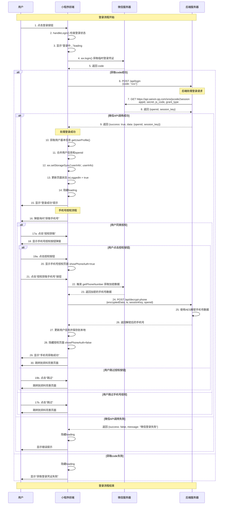
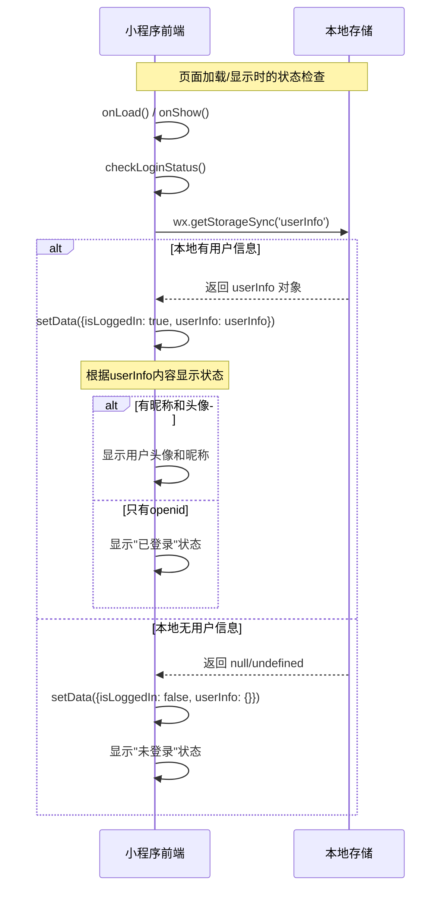
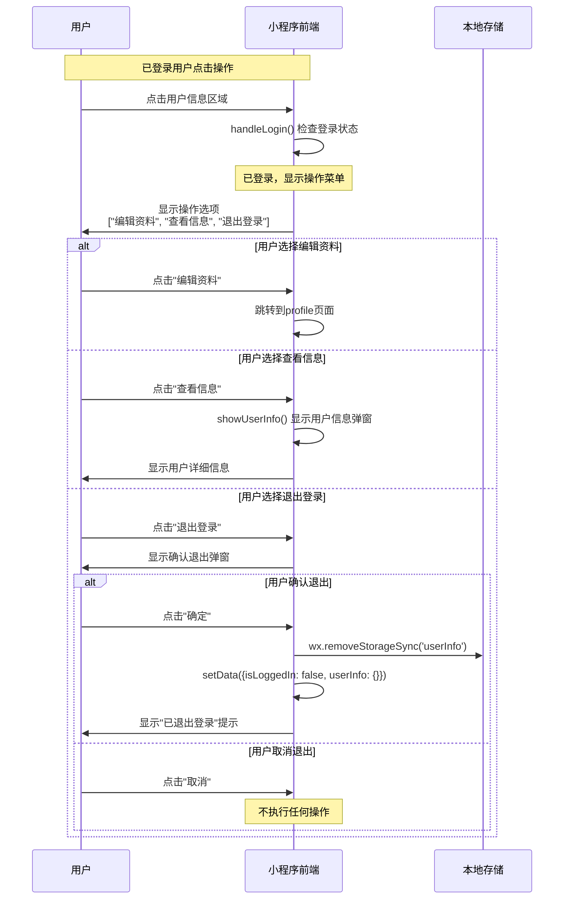
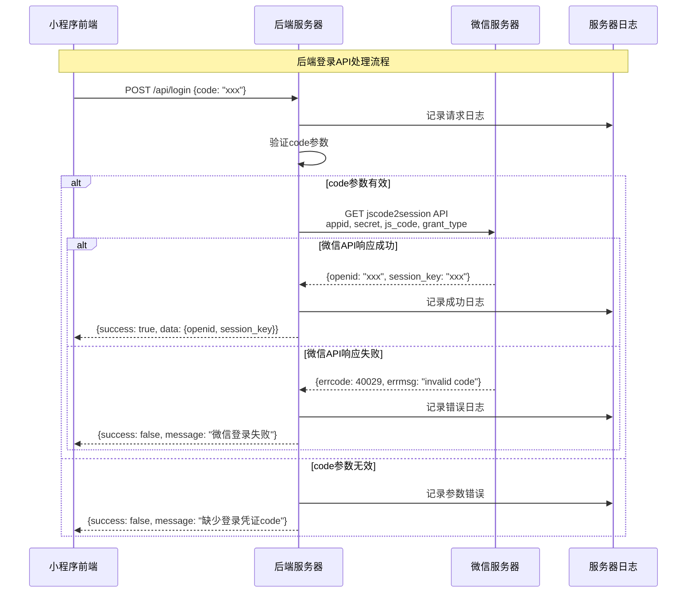
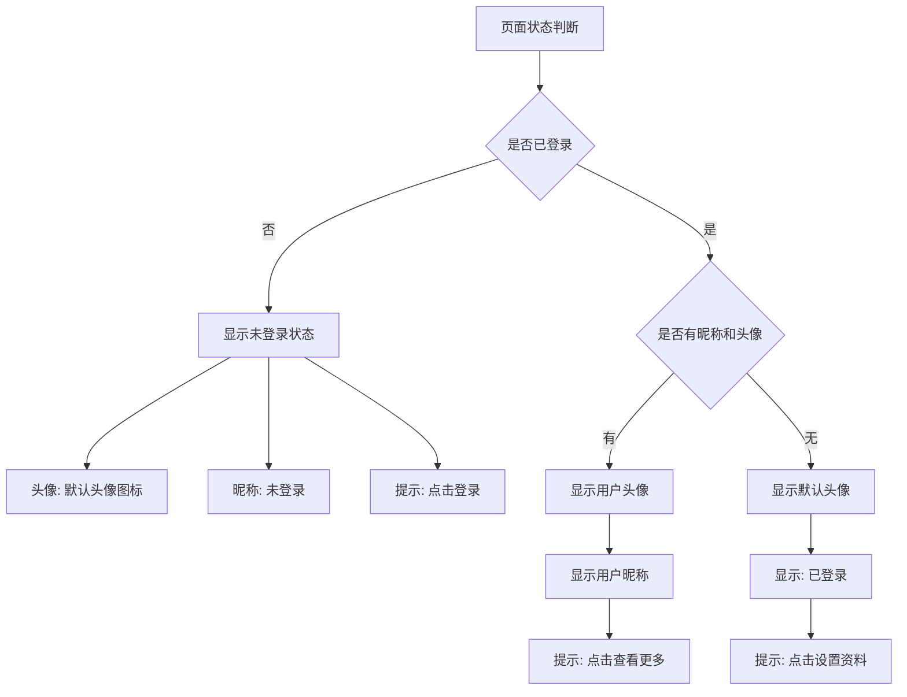

# 微信小程序登录流程文档

## 概述
本文档描述了微信小程序简化登录流程的完整时序图，包括小程序前端与后端服务器的交互过程。

---

## 1. 主要登录流程时序图

### 参与者说明
- **用户 (User)**: 小程序使用者
- **小程序前端 (MiniProgram)**: 微信小程序客户端
- **微信服务器 (WeChat Server)**: 微信官方API服务器
- **后端服务器 (Backend Server)**: 自建业务服务器

### 登录时序流程



### 文字描述流程

```
用户 -> 小程序前端: 1. 点击登录按钮
小程序前端 -> 小程序前端: 2. handleLogin() 检查登录状态
小程序前端 -> 小程序前端: 3. 显示"登录中..."loading

小程序前端 -> 微信服务器: 4. wx.login() 获取临时登录凭证
微信服务器 -> 小程序前端: 5. 返回 code

小程序前端 -> 后端服务器: 6. POST /api/login {code: "xxx"}
后端服务器 -> 微信服务器: 7. GET jscode2session API
微信服务器 -> 后端服务器: 8. 返回 {openid, session_key}
后端服务器 -> 小程序前端: 9. 返回 {success: true, data: {openid, session_key}}

小程序前端 -> 小程序前端: 10. 获取用户基本信息 getUserProfile()
小程序前端 -> 小程序前端: 11. 合并用户信息和openid
小程序前端 -> 小程序前端: 12. wx.setStorageSync('userInfo', userInfo)
小程序前端 -> 小程序前端: 13. 更新页面状态 isLoggedIn = true
小程序前端 -> 小程序前端: 14. 隐藏loading
小程序前端 -> 用户: 15. 显示"登录成功"提示

小程序前端 -> 用户: 16. 弹窗询问"获取手机号"
用户 -> 小程序前端: 17a. 选择"授权获取" -> 显示手机号授权按钮弹窗
用户 -> 小程序前端: 17b. 选择"跳过" -> 跳转到资料完善页面

[手机号授权流程 - 用户选择授权的情况]
小程序前端 -> 用户: 18. 显示手机号授权按钮弹窗
用户 -> 小程序前端: 19a. 点击授权按钮 -> 显示手机号授权页面
用户 -> 小程序前端: 19b. 点击跳过 -> 跳转到资料完善页面

小程序前端 -> 小程序前端: 20. 显示手机号授权页面 showPhoneAuth=true
用户 -> 小程序前端: 21. 点击"授权获取手机号"按钮
小程序前端 -> 微信服务器: 22. 触发 getPhoneNumber 获取加密数据
微信服务器 -> 小程序前端: 23. 返回加密的手机号数据

小程序前端 -> 后端服务器: 24. POST /api/decrypt-phone {encryptedData, iv, sessionKey, openid}
后端服务器 -> 后端服务器: 25. 使用AES解密手机号数据
后端服务器 -> 小程序前端: 26. 返回解密后的手机号

小程序前端 -> 小程序前端: 27. 更新用户信息并保存到本地
小程序前端 -> 小程序前端: 28. 隐藏授权页面 showPhoneAuth=false
小程序前端 -> 用户: 29. 显示"手机号获取成功"
小程序前端 -> 用户: 30. 跳转到资料完善页面
```

---

## 2. 页面状态检查流程

### 页面加载时的状态检查



### 文字描述流程

```
小程序前端 -> 小程序前端: onLoad() / onShow()
小程序前端 -> 小程序前端: checkLoginStatus()
小程序前端 -> 本地存储: wx.getStorageSync('userInfo')

[情况A: 本地有用户信息]
本地存储 -> 小程序前端: 返回 userInfo 对象
小程序前端 -> 小程序前端: setData({isLoggedIn: true, userInfo: userInfo})
小程序前端 -> 小程序前端: 显示用户状态（根据是否有昵称头像）

[情况B: 本地无用户信息]
本地存储 -> 小程序前端: 返回 null/undefined
小程序前端 -> 小程序前端: setData({isLoggedIn: false, userInfo: {}})
小程序前端 -> 小程序前端: 显示"未登录"状态
```

---

## 3. 已登录用户操作流程

### 用户操作菜单交互



### 文字描述流程

```
用户 -> 小程序前端: 点击用户信息区域
小程序前端 -> 小程序前端: handleLogin() 检查登录状态
小程序前端 -> 用户: 显示操作选项 ["编辑资料", "查看信息", "退出登录"]

[选项A: 编辑资料]
用户 -> 小程序前端: 点击"编辑资料"
小程序前端 -> 小程序前端: 跳转到profile页面

[选项B: 查看信息]
用户 -> 小程序前端: 点击"查看信息"
小程序前端 -> 小程序前端: showUserInfo() 显示用户信息弹窗
小程序前端 -> 用户: 显示用户详细信息

[选项C: 退出登录]
用户 -> 小程序前端: 点击"退出登录"
小程序前端 -> 用户: 显示确认退出弹窗
用户 -> 小程序前端: 点击"确定"
小程序前端 -> 本地存储: wx.removeStorageSync('userInfo')
小程序前端 -> 小程序前端: setData({isLoggedIn: false, userInfo: {}})
小程序前端 -> 用户: 显示"已退出登录"提示
```

---

## 4. 后端API处理详情

### 登录API处理流程



### 文字描述流程

```
小程序前端 -> 后端服务器: POST /api/login {code: "xxx"}
后端服务器 -> 服务器日志: 记录请求日志
后端服务器 -> 后端服务器: 验证code参数

[参数有效情况]
后端服务器 -> 微信服务器: GET jscode2session API (appid, secret, js_code, grant_type)

[微信API成功]
微信服务器 -> 后端服务器: {openid: "xxx", session_key: "xxx"}
后端服务器 -> 服务器日志: 记录成功日志
后端服务器 -> 小程序前端: {success: true, data: {openid, session_key}}

[微信API失败]
微信服务器 -> 后端服务器: {errcode: 40029, errmsg: "invalid code"}
后端服务器 -> 服务器日志: 记录错误日志
后端服务器 -> 小程序前端: {success: false, message: "微信登录失败"}

[参数无效情况]
后端服务器 -> 服务器日志: 记录参数错误
后端服务器 -> 小程序前端: {success: false, message: "缺少登录凭证code"}
```

---

## 5. 数据结构说明

### 用户信息结构

```javascript
// 登录成功后存储的用户信息
{
  openid: "oOFF71xL3sJ-C-MK_e6MTQWWAeNY",     // 微信用户唯一标识
  session_key: "xxx",                          // 会话密钥
  loginTime: "2023-12-27T10:30:00.000Z",      // 登录时间
  nickName: "用户昵称",                        // 用户昵称（通过getUserProfile获取）
  avatarUrl: "https://xxx.jpg",               // 用户头像（通过getUserProfile获取）
  // 以下字段通过手机号授权获取（可选）
  phoneNumber: "138****8888",                 // 用户手机号
  phoneUpdateTime: "2023-12-27T10:35:00.000Z" // 手机号更新时间
}
```

### API请求响应格式

#### 登录请求
```javascript
// 请求
POST /api/login
{
  "code": "0x1a2b3c4d5e6f"
}

// 成功响应
{
  "success": true,
  "data": {
    "openid": "oOFF71xL3sJ-C-MK_e6MTQWWAeNY",
    "session_key": "xxx"
  }
}

// 失败响应
{
  "success": false,
  "message": "微信登录失败",
  "error": {...}
}
```

#### 手机号解密请求
```javascript
// 请求
POST /api/decrypt-phone
{
  "encryptedData": "xxx",
  "iv": "xxx",
  "sessionKey": "xxx",
  "openid": "oOFF71xL3sJ-C-MK_e6MTQWWAeNY"
}

// 成功响应
{
  "success": true,
  "data": {
    "phoneNumber": "138****8888",
    "purePhoneNumber": "13888888888",
    "countryCode": "86",
    "watermark": {
      "timestamp": 1640592000,
      "appid": "wxff2f1bbc40fa907c"
    }
  }
}

// 失败响应
{
  "success": false,
  "message": "手机号解密失败",
  "error": {...}
}
```

---

## 6. 核心功能说明

### 主要功能模块
1. **微信登录认证** - wx.login + 后端openid换取
2. **用户基本信息获取** - 通过wx.getUserProfile获取昵称和头像
3. **手机号授权流程** - 包括加密解密、授权弹窗等（可选）
4. **本地状态管理** - 用户信息缓存和状态检查
5. **用户操作菜单** - 编辑资料、查看信息、退出登录

### 登录流程特点
- **渐进式授权** - 用户可以选择跳过手机号授权
- **多层确认** - 手机号授权包含多个确认步骤
- **错误处理** - 完善的错误处理和重试机制
- **用户友好** - 清晰的提示和引导流程

### 技术实现要点
- **数据加密** - 手机号数据使用AES-128-CBC加密传输
- **会话管理** - 使用session_key进行数据解密
- **本地存储** - 用户信息持久化存储
- **状态同步** - 页面状态与本地存储保持同步

---

## 7. 错误处理机制

### 前端错误处理
- **网络请求失败** - 显示网络错误提示，提供重试选项
- **微信登录失败** - 显示登录失败原因，引导用户重试
- **本地存储异常** - 容错处理，重置登录状态

### 后端错误处理
- **参数验证** - 检查必需参数，返回明确错误信息
- **微信API调用失败** - 记录详细日志，返回用户友好提示
- **服务器异常** - 统一异常处理，避免敏感信息泄露

---

## 8. 页面状态显示逻辑

### 显示状态判断流程



### 状态显示说明
- **未登录状态**: 显示默认头像、"未登录"文字、"点击登录"提示
- **已登录未设置资料**: 显示默认头像、"已登录"文字、"点击设置资料"提示
- **已登录已设置资料**: 显示用户头像、用户昵称、"点击查看更多"提示

---

## 9. 开发注意事项

### 前端开发要点
1. **登录状态检查**: 在页面onLoad和onShow时都要检查登录状态
2. **错误处理**: 对所有异步操作进行try-catch处理
3. **用户体验**: 提供清晰的loading状态和错误提示
4. **数据存储**: 使用wx.setStorageSync进行本地数据持久化

### 后端开发要点
1. **参数验证**: 严格验证所有输入参数
2. **日志记录**: 记录详细的请求和响应日志
3. **错误处理**: 统一的错误响应格式
4. **安全性**: 保护appSecret等敏感信息

### 测试要点
1. **网络异常测试**: 模拟网络断开、超时等情况
2. **边界条件测试**: 测试各种异常输入和状态
3. **用户体验测试**: 确保各种操作流程的用户体验
4. **兼容性测试**: 在不同设备和微信版本上测试

这个文档完整记录了简化后的登录流程，可以作为开发和维护的参考文档。
