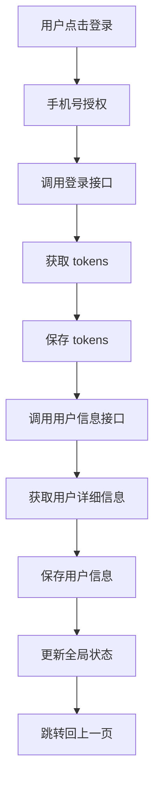
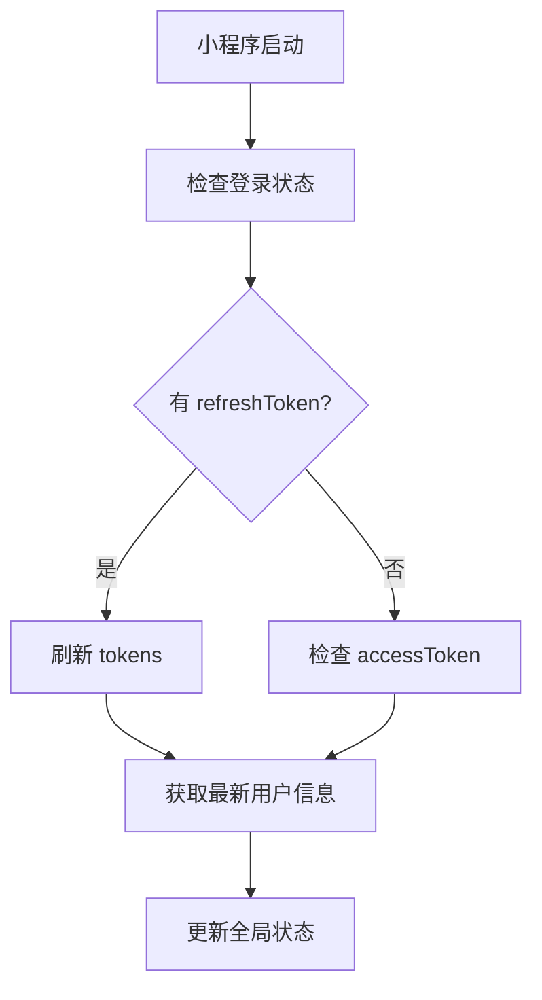

# 登录功能调整实施总结

## 📋 需求概述

根据需求文档中的"登录功能调整"章节，本次调整的核心目标是：

1. **分离登录和用户信息获取**：登录接口只返回 `accessToken` 和 `refreshToken`，用户信息通过单独接口获取
2. **调整用户信息结构**：包含手机号、姓名、按钮权限（array格式）
3. **自动刷新机制**：登录完成后自动获取用户信息，小程序启动时自动刷新用户信息

## 🎯 实施内容

### 1. 后端接口调整

#### 1.1 登录接口 `/api/login`
- ✅ **已符合要求**：只返回 `accessToken` 和 `refreshToken`
- ✅ **数据格式**：
  ```json
  {
    "success": true,
    "data": {
      "accessToken": "access_xxx_xxx_xxx",
      "refreshToken": "refresh_xxx_xxx_xxx"
    }
  }
  ```

#### 1.2 用户信息接口 `/api/user/profile`
- ✅ **接口优化**：使用 token 验证身份，返回标准化用户信息
- ✅ **返回格式**：
  ```json
  {
    "success": true,
    "data": {
      "phoneNumber": "138****8888",
      "name": "张三",
      "permissions": ["qrcode", "buy-car"]
    }
  }
  ```
- ✅ **默认处理**：用户信息不存在时自动创建默认信息文件
- ✅ **权限数组**：确保 permissions 字段为数组格式

### 2. 前端工具模块重构

#### 2.1 `utils/auth.js` 重构
- ✅ **新增方法**：`fetchUserProfile()` - 独立的用户信息获取方法
- ✅ **重构登录流程**：`performLogin()` 方法分离登录和用户信息获取
  ```javascript
  // 新的登录流程
  1. 获取微信登录code
  2. 调用登录接口（只获取tokens）
  3. 保存tokens到本地
  4. 调用用户信息接口
  5. 构建完整用户信息并保存
  ```
- ✅ **优化刷新逻辑**：`refreshUserInfo()` 使用新的用户信息接口
- ✅ **错误处理**：登录失败时自动清除部分数据，避免状态不一致

#### 2.2 用户信息数据结构
- ✅ **标准化结构**：
  ```javascript
  userInfo: {
    nickName: "用户昵称",
    avatarUrl: "/assets/imgs/logo.png",
    identity: "游客",
    phoneNumber: "138****8888",
    name: "真实姓名",
    permissions: ["qrcode", "buy-car"]
  }
  ```

### 3. 页面逻辑调整

#### 3.1 `app.js` 应用启动逻辑
- ✅ **优化状态检查**：使用 `storage.getUserInfo()` 获取用户信息
- ✅ **全局状态管理**：确保全局状态与本地存储数据一致
- ✅ **自动刷新**：启动时自动刷新用户信息

#### 3.2 `pages/profile/profile.js` 个人中心页面
- ✅ **用户信息显示**：直接从 `storage.getUserInfo()` 获取用户信息
- ✅ **优化刷新策略**：移除页面级别的主动刷新，避免与app.js重复请求
- ✅ **本地存储优先**：只从本地存储读取用户信息，依赖app.js启动刷新保证数据新鲜度
- ✅ **状态同步**：确保页面显示与实际登录状态一致

#### 3.3 `pages/login/login.js` 登录页面
- ✅ **登录流程**：已适配新的登录逻辑，无需额外调整
- ✅ **状态更新**：登录成功后正确更新全局状态

## 🔄 数据流程

### 登录流程


### 启动刷新流程


## ✅ 功能验证要点

### 1. 登录功能
- [ ] 手机号授权正常
- [ ] 登录接口只返回 tokens
- [ ] 用户信息接口正常获取数据
- [ ] 本地存储数据结构正确
- [ ] 全局状态更新正确

### 2. 用户信息刷新
- [ ] 小程序启动时自动刷新
- [ ] 个人中心页面显示时刷新
- [ ] 网络异常时使用本地数据
- [ ] 权限数据为数组格式

### 3. 登出功能
- [ ] 清除本地存储数据
- [ ] 重置全局状态
- [ ] 页面状态正确更新

## 🚨 注意事项

1. **向后兼容**：按需求要求，不考虑旧接口兼容性
2. **错误处理**：网络异常时优雅降级，使用本地数据
3. **数据一致性**：确保本地存储、全局状态、页面显示三者一致
4. **权限管理**：虽然暂时不使用权限数据，但确保数据结构正确

## 📝 后续优化建议

1. **模块化优化**：可考虑创建独立的用户信息管理模块
2. **缓存策略**：可添加用户信息缓存有效期管理
3. **错误监控**：可添加登录流程的错误统计和监控
4. **性能优化**：可优化频繁的用户信息刷新逻辑

## 🎉 完成状态

- ✅ 后端接口调整完成
- ✅ 前端工具模块重构完成
- ✅ 页面逻辑调整完成
- ✅ 数据流程优化完成

**总结**：登录功能调整已按需求完成，实现了登录和用户信息获取的分离，优化了用户信息管理流程，提升了系统的模块化程度和可维护性。
