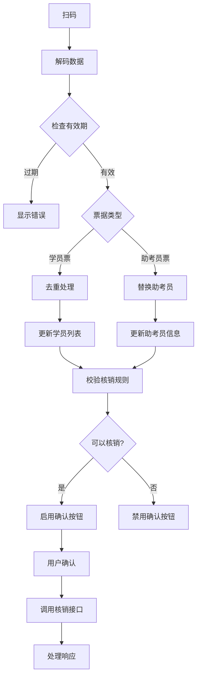

# 模拟票核销功能 - 核销逻辑实现总结

## 📋 实现概述

本次实现完成了模拟票核销功能的核销逻辑章节，包括扫码、票据管理、核销校验和提交等完整流程。

## 🎯 核心功能实现

### 1. 后端接口实现

#### 核销接口 `/api/ticket/verify`
- **方法**: POST
- **认证**: 需要访问令牌
- **参数**:
  ```javascript
  {
    assistantUserId: string, // 助考员ID
    ticketIdList: string[]   // 票据ID列表
  }
  ```
- **校验规则**:
  - 必须有助考员ID和票据列表
  - 票据数量限制：1-4张
  - 95%成功率模拟

#### 用户信息接口增强
- 在 `/api/user/profile` 接口中添加了 `userId` 字段
- 确保助考员票据包含用户ID信息

### 2. 前端核销逻辑实现

#### A. 数据结构设计
```javascript
data: {
  // 待核销票据管理
  scannedTickets: [],      // 扫描的所有票据
  studentTickets: [],      // 学员票列表
  assistantTicket: null,   // 助考员票（只能有一个）

  // 核销状态
  canVerify: false,        // 是否可以核销
  verifyLoading: false     // 核销中状态
}
```

#### B. 扫码处理逻辑
- **二维码解码**: 使用现有的 `decodeQRData` 函数
- **有效期校验**: 检查 `expireTime` 字段
- **类型识别**: 区分 `mock-ticket` 和 `assist-ticket`
- **数据处理**: 根据类型调用不同处理方法

#### C. 学员票管理
- **去重逻辑**: 基于手机号去重，同一手机号只保留最新票据
- **数量限制**: 最多4张学员票
- **替换机制**: 重复扫码时替换现有票据

#### D. 助考员票管理
- **唯一性**: 只能有一个助考员
- **替换机制**: 新扫码的助考员替换现有助考员

#### E. 核销校验规则
- 必须有且仅有1位助考员
- 学员票数量：1-4张
- 校验通过后启用确认按钮

#### F. 核销提交流程
1. 校验规则检查
2. 显示确认弹窗（包含助考员和学员信息）
3. 调用后端核销接口
4. 处理成功/失败响应
5. 清空待核销票据
6. 刷新已核销列表

### 3. UI界面实现

#### A. 待核销票据展示区域
- **区域标题**: 显示"待核销票据"和票据数量
- **清空按钮**: 一键清空所有待核销票据
- **助考员票**: 金色渐变背景，大气高端设计
- **学员票**: 简洁白色卡片，清晰信息展示

#### B. 助考员票样式特色
- **背景**: 金色渐变 + 径向光效装饰
- **徽章**: 毛玻璃效果圆形图标
- **文字**: 白色文字配阴影效果
- **整体**: 体现高端、大气的视觉效果

#### C. 学员票信息展示
- **标题**: 套餐名称
- **详细信息**: 学员姓名、证件号码、模拟场区
- **图标**: 主题色圆形徽章
- **布局**: 清晰的信息层级

#### D. 按钮状态管理
- **扫码按钮**: 始终可用
- **确认按钮**: 根据校验规则动态启用/禁用
- **状态样式**: 活跃/禁用/加载中不同样式
- **交互反馈**: 触觉反馈和视觉效果

## 🔧 技术实现细节

### 1. 数据流程


### 2. 错误处理机制
- **扫码错误**: 二维码格式、解码失败、过期等
- **校验错误**: 票据数量、助考员缺失等
- **网络错误**: 接口调用失败、超时等
- **用户提示**: 友好的错误信息展示

### 3. 状态管理
- **响应式更新**: 数据变化自动更新UI
- **状态同步**: 扫码结果实时反映到界面
- **加载状态**: 核销过程中的加载提示

## 📱 UI设计亮点

### 1. 助考员票设计
- **视觉层次**: 金色渐变背景突出重要性
- **装饰效果**: 径向光效增加高端感
- **信息展示**: 大字体姓名 + 电话号码
- **图标设计**: 毛玻璃效果徽章

### 2. 学员票设计
- **简洁风格**: 白色卡片背景保持清晰
- **信息结构**: 标题 + 详细信息分层展示
- **视觉区分**: 与助考员票形成对比
- **图标统一**: 主题色圆形徽章

### 3. 交互体验
- **即时反馈**: 扫码成功立即显示票据
- **状态提示**: 按钮状态清晰表达可操作性
- **确认流程**: 详细的核销确认信息
- **错误处理**: 友好的错误提示

## 🔍 数据结构说明

### 学员票数据结构
```javascript
{
  type: 'mock-ticket',
  ticketId: 'ticket_001',
  studentName: '张三',
  studentPhone: '13800138000',
  idCard: '110101199001011234',
  packageName: '科目二模拟考试套餐A',
  simulationArea: '模拟场区A',
  generateTime: 1704067200000,
  expireTime: 1704067380000
}
```

### 助考员票数据结构
```javascript
{
  type: 'assist-ticket',
  userId: 'user_openid_1704067200000',
  assistantName: '李教练',
  assistantPhone: '13900139000',
  generateTime: 1704067200000,
  expireTime: 1704067380000
}
```

## ✅ 功能验证要点

### 1. 扫码功能
- [ ] 能正确扫描学员票二维码
- [ ] 能正确扫描助考员二维码
- [ ] 过期二维码被正确拒绝
- [ ] 无效二维码显示错误提示

### 2. 票据管理
- [ ] 学员票按手机号去重
- [ ] 学员票数量限制在4张以内
- [ ] 助考员票只保留一个
- [ ] 重复扫码正确替换

### 3. 核销校验
- [ ] 必须有助考员才能核销
- [ ] 必须有学员票才能核销
- [ ] 按钮状态正确反映校验结果
- [ ] 确认弹窗显示正确信息

### 4. 接口调用
- [ ] 核销接口参数正确
- [ ] 成功响应正确处理
- [ ] 失败响应显示错误信息
- [ ] 网络错误正确处理

## 🎨 样式实现特色

### 1. 主题色应用
- 助考员票使用主题色渐变背景
- 学员票图标使用主题色
- 按钮状态使用主题色系

### 2. 响应式设计
- 小屏幕设备适配
- 字体大小自适应
- 按钮尺寸调整

### 3. 深色模式支持
- 阴影效果适配
- 颜色对比度优化

## 🔧 技术栈

- **前端**: 微信小程序原生开发
- **样式**: WXSS + CSS变量
- **状态管理**: 页面级数据管理
- **网络请求**: 封装的request工具
- **二维码**: 现有encoder工具
- **后端**: Express.js + Node.js

## 📈 性能优化

- **按需渲染**: 只在有票据时显示待核销区域
- **状态缓存**: 避免不必要的数据更新
- **样式优化**: 使用CSS变量和主题系统
- **交互优化**: 触觉反馈和动画效果

## 🚀 部署说明

1. **前端部署**: 直接在小程序中使用
2. **后端部署**: 确保服务器运行在正确端口
3. **接口配置**: 检查API地址配置
4. **权限验证**: 确保用户有核销权限

## 📝 使用说明

1. **扫码添加**: 点击扫码按钮扫描票据
2. **查看票据**: 在待核销区域查看已扫描票据
3. **清空票据**: 点击清空按钮移除所有票据
4. **确认核销**: 满足条件后点击确认核销
5. **查看结果**: 核销成功后查看已核销记录

## 🔮 后续优化建议

1. **批量操作**: 支持批量删除特定票据
2. **历史记录**: 保存核销历史记录
3. **统计功能**: 添加核销统计图表
4. **权限细化**: 更精细的权限控制
5. **离线支持**: 支持离线扫码和同步

---

**实现完成时间**: 2025年10月6日
**实现状态**: ✅ 完成
**测试状态**: ⏳ 待测试
**文档状态**: ✅ 已完成
