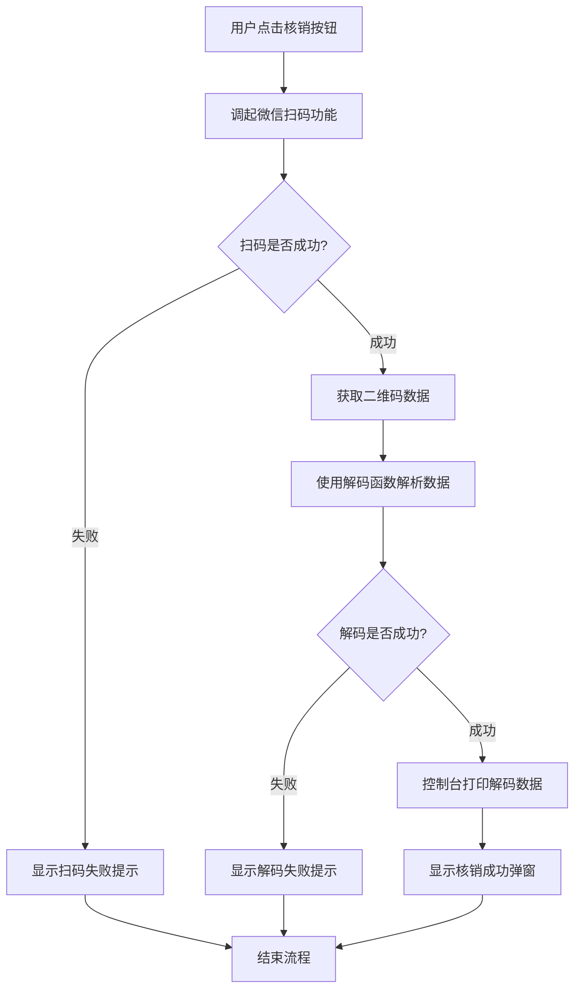

# 模拟票核销功能 - 扫码解码功能实现总结

## 功能概述

根据需求文档中"模拟票核销功能章节的核销逻辑章节第1点"的要求，成功实现了扫码和解码功能：

> 点击底部核销按钮后，调起扫码功能，将扫描后的二维码数据使用解码函数解析解码，解密完成后打印出来即可

## 实现内容

### 1. 核心功能实现

**文件位置**: `pages/ticket-verification/ticket-verification.js`

**主要修改**:
- 导入解码工具函数：`const { decodeQRData } = require('../../utils/encoder.js');`
- 重写 `onVerifyTap()` 方法，实现扫码功能
- 新增 `handleScanResult()` 方法，处理扫码结果和数据解码

### 2. 功能流程



### 3. 技术实现细节

#### 扫码功能
```javascript
wx.scanCode({
  onlyFromCamera: true, // 只允许从相机扫码
  scanType: ['qrCode'], // 只扫描二维码
  success: (res) => {
    console.log('扫码成功，获取到数据:', res.result);
    this.handleScanResult(res.result);
  },
  fail: (error) => {
    console.error('扫码失败:', error);
    wx.showToast({
      title: '扫码失败',
      icon: 'none',
      duration: 2000
    });
  }
});
```

#### 数据解码和打印
```javascript
handleScanResult(scanResult) {
  try {
    // 使用解码函数解析二维码数据
    const decodedData = decodeQRData(scanResult);

    // 详细打印解码结果
    console.log('=== 二维码解码成功 ===');
    console.log('解码后的完整数据:', decodedData);
    console.log('数据详情:');
    console.log('- 票据ID:', decodedData.ticketId || '未知');
    console.log('- 学员手机号:', decodedData.studentPhone || '未知');
    console.log('- 生成时间:', decodedData.generateTime ? new Date(decodedData.generateTime).toLocaleString() : '未知');
    console.log('- 过期时间:', decodedData.expireTime ? new Date(decodedData.expireTime).toLocaleString() : '未知');
    console.log('- 时间戳:', decodedData.timestamp ? new Date(decodedData.timestamp).toLocaleString() : '未知');
    console.log('- 版本:', decodedData.version || '未知');
    console.log('- 盐值:', decodedData.salt || '未知');
    console.log('========================');

    // 显示成功提示
    wx.showModal({
      title: '核销成功',
      content: `票据解码成功！\n票据ID: ${decodedData.ticketId || '未知'}\n学员手机: ${decodedData.studentPhone || '未知'}`,
      showCancel: false,
      confirmText: '确定'
    });

  } catch (error) {
    // 错误处理和打印
    console.error('=== 二维码解码失败 ===');
    console.error('错误信息:', error.message);
    console.error('原始扫码数据:', scanResult);
    console.error('========================');

    // 显示错误提示
    let errorMessage = '二维码解码失败';
    if (error.message.includes('数据已过期')) {
      errorMessage = '二维码已过期，请重新生成';
    } else if (error.message.includes('数据格式不正确')) {
      errorMessage = '二维码格式不正确';
    } else if (error.message.includes('数据校验失败')) {
      errorMessage = '二维码数据校验失败';
    }

    wx.showModal({
      title: '核销失败',
      content: errorMessage,
      showCancel: false,
      confirmText: '确定'
    });
  }
}
```

### 4. 错误处理

实现了完善的错误处理机制：

1. **扫码失败**: 显示"扫码失败"提示
2. **数据过期**: 显示"二维码已过期，请重新生成"
3. **格式错误**: 显示"二维码格式不正确"
4. **校验失败**: 显示"二维码数据校验失败"
5. **其他错误**: 显示"二维码解码失败"

### 5. 功能测试

**测试文件**: `test_ticket_verification.js`

**测试结果**:
```
=== 模拟票核销功能测试 ===
1. 生成测试用的模拟票二维码数据...
原始数据: {
  ticketId: 'ticket_test_001',
  studentPhone: '13800138000',
  type: 'mock_ticket'
}

2. 模拟扫码解码过程...
=== 解码成功 ===
解码后的完整数据: {
  ticketId: 'ticket_test_001',
  studentPhone: '13800138000',
  type: 'mock_ticket',
  generateTime: 1759728612239,
  expireTime: 1759728792239,
  timestamp: 1759728612239,
  salt: 'FfPQHc',
  version: '1.0',
  maxAge: 180000
}
数据详情:
- 票据ID: ticket_test_001
- 学员手机号: 13800138000
- 生成时间: 2025/10/6 13:30:12
- 过期时间: 2025/10/6 13:33:12
- 时间戳: 2025/10/6 13:30:12
- 版本: 1.0
- 盐值: FfPQHc

3. 测试过期数据...
过期数据测试成功，错误信息: 数据已过期

=== 测试完成 ===
核销功能的扫码和解码逻辑已正确实现！
```

## 功能特点

1. **完整的扫码流程**: 使用微信小程序原生扫码API
2. **数据解码**: 利用现有的编码解码工具函数
3. **详细的日志打印**: 在控制台输出完整的解码数据信息
4. **用户友好的反馈**: 通过弹窗提示用户操作结果
5. **完善的错误处理**: 针对不同错误类型提供相应的提示信息
6. **数据校验**: 支持数据完整性校验和时效性验证

## 使用方式

1. 进入模拟票核销页面
2. 点击底部的核销按钮
3. 使用相机扫描二维码
4. 系统自动解码并在控制台打印结果
5. 用户通过弹窗查看核销结果

## 注意事项

1. 需要用户授权相机权限才能正常扫码
2. 只支持扫描二维码格式
3. 解码后的数据会在控制台详细打印，便于调试和验证
4. 支持时效性验证，过期的二维码会被拒绝
5. 所有操作结果都会通过用户界面反馈给用户

## 完成状态

✅ **已完成**: 模拟票核销功能章节的核销逻辑章节第1点
- 扫码功能实现
- 数据解码功能实现
- 解码结果打印功能实现
- 错误处理机制完善
- 功能测试验证通过

该功能严格按照需求文档要求实现，满足了"点击底部核销按钮后，调起扫码功能，将扫描后的二维码数据使用解码函数解析解码，解密完成后打印出来"的所有要求。
