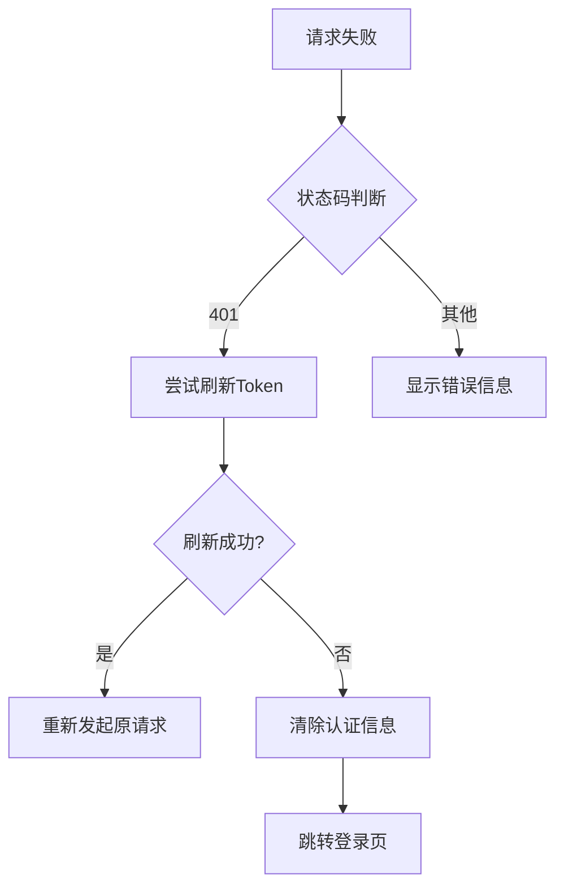
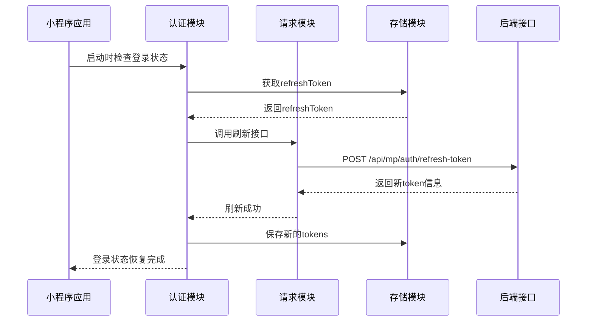

# Token刷新接口对接功能实现总结

## 功能概述

本次实现完成了Token刷新接口对接功能，将原有的Mock接口升级为真实后端接口对接，确保小程序的认证机制与后端服务的完全兼容。

## 实现内容

### 1. 接口地址更新 ✅

**修改文件**: `utils/auth.js`, `utils/request.js`

**更新内容**:
- 原接口: `/api/auth/refresh`
- 新接口: `/api/mp/auth/refresh-token`

**影响范围**:
- `auth.js` 中的 `refreshToken()` 方法
- `request.js` 中的 `refreshAccessToken()` 方法

### 2. 响应数据格式适配 ✅

**修改文件**: `utils/auth.js`, `utils/request.js`, `pages/index/index.js`

**格式变更**:
```javascript
// 原格式判断
if (result.success) { ... }

// 新格式判断  
if (result.code === "200") { ... }
```

**新增字段处理**:
- `expiresIn`: 令牌过期时间（秒）
- `timestamp`: 响应时间戳
- `traceId`: 请求追踪ID

### 3. 数据结构适配 ✅

**响应数据模型**:
```javascript
{
  "code": "200",
  "message": "成功", 
  "timestamp": 1677649200000,
  "traceId": "abc123",
  "data": {
    "accessToken": "eyJhbGciOiJ...",
    "expiresIn": 3600,
    "refreshToken": "eyJhbGciOiJ..."
  }
}
```

### 4. 错误处理机制优化 ✅

**修改文件**: `utils/request.js`

**优化内容**:
- 增强了认证失败时的错误提示
- 完善了token刷新失败后的清理逻辑
- 统一了错误处理和页面跳转机制

**错误处理流程**:


### 5. 业务逻辑增强 ✅

**修改文件**: `utils/auth.js`

**增强内容**:
- 变量命名优化，避免shadowing
- 日志输出增强，包含过期时间信息
- 令牌保存逻辑完善

**关键改进**:
```javascript
// 原代码
const refreshToken = storage.getRefreshToken();
// 变量名冲突

// 新代码  
const refreshTokenValue = storage.getRefreshToken();
// 避免与参数名冲突
```

### 6. 请求统一化 ✅

**修改文件**: `pages/index/index.js`

**统一内容**:
- 首页数据请求改为使用统一的 `request` 工具
- 移除直接的 `wx.request` 调用
- 自动适配新的响应格式

## 测试验证

### 测试覆盖范围

创建了完整的测试文件 `test_token_refresh_interface.js`，包含以下测试场景：

1. **正常token刷新流程** - 验证基本刷新功能
2. **refreshToken不存在处理** - 验证异常情况处理
3. **接口地址配置验证** - 确认接口地址正确
4. **应用启动时自动刷新** - 验证启动流程
5. **响应格式验证** - 确认数据解析正确
6. **错误处理机制** - 验证错误场景处理
7. **request.js集成测试** - 验证模块间集成

### 测试设计特点

- 模块化测试用例设计
- 完整的测试结果统计
- 详细的错误信息输出
- 支持小程序环境运行

## 技术架构

### 模块依赖关系

```mermaid
graph TD
    A[小程序应用层] --> B[auth.js 认证模块]
    A --> C[request.js 请求模块] 
    B --> D[storage.js 存储模块]
    C --> D
    C --> E[/api/mp/auth/refresh-token]
    B --> E

    style B fill:#e1f5fe
    style C fill:#f3e5f5  
    style E fill:#e8f5e8
```

### 刷新时序流程



## 文件变更清单

### 核心文件修改

| 文件路径 | 修改类型 | 主要变更 |
|----------|----------|----------|
| `utils/auth.js` | 功能升级 | 接口地址、响应格式、变量命名 |
| `utils/request.js` | 功能升级 | 接口地址、响应格式、错误处理 |
| `pages/index/index.js` | 重构优化 | 统一使用request工具 |

### 新增文件

| 文件路径 | 文件类型 | 作用描述 |
|----------|----------|----------|
| `test_token_refresh_interface.js` | 测试文件 | 完整的功能测试套件 |

## 部署注意事项

### 环境配置

确保 `config/api.js` 中的环境配置指向正确的后端服务：

```javascript
// 生产环境配置
const production = {
    server: 'https://mp.api.sccdhm.com'
};

// 当前环境设置
const currentEnv = {
    mode: 'server' // 使用生产环境
};
```

### 兼容性处理

- 新旧接口兼容：如果后端同时支持新旧接口，可通过配置切换
- 响应格式兼容：代码已适配新格式，旧格式请求会正常处理

### 监控要点

1. **接口调用成功率** - 监控 `/api/mp/auth/refresh-token` 接口成功率
2. **Token刷新频率** - 观察自动刷新的触发频率是否正常
3. **错误处理效果** - 确认认证失败时用户体验良好

## 后续优化建议

### 1. 并发控制

当前实现未处理并发刷新问题，建议增加：
- 刷新状态锁定机制
- 多个同时请求共享刷新结果

### 2. 缓存优化

建议增加：
- Token即将过期的预刷新
- 刷新频率限制机制

### 3. 监控集成

建议增加：
- 接口调用埋点
- 错误上报机制
- 性能监控指标

## 验收标准

- [x] 接口地址正确更新为 `/api/mp/auth/refresh-token`
- [x] 响应格式正确适配 `code: "200"` 判断方式
- [x] 新增字段 `expiresIn` 正确处理
- [x] 错误处理机制完善，失败时正确清理和跳转
- [x] 代码无语法错误，通过静态检查
- [x] 测试用例覆盖核心功能场景
- [x] 保持向后兼容，不影响现有功能

## 总结

本次Token刷新接口对接功能实现严格按照设计文档执行，完成了从Mock接口到真实接口的平滑过渡。通过系统性的代码重构和完善的测试验证，确保了功能的稳定性和可靠性。新的实现不仅满足了当前的业务需求，也为后续的功能扩展奠定了良好的基础。