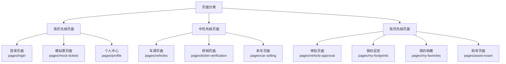
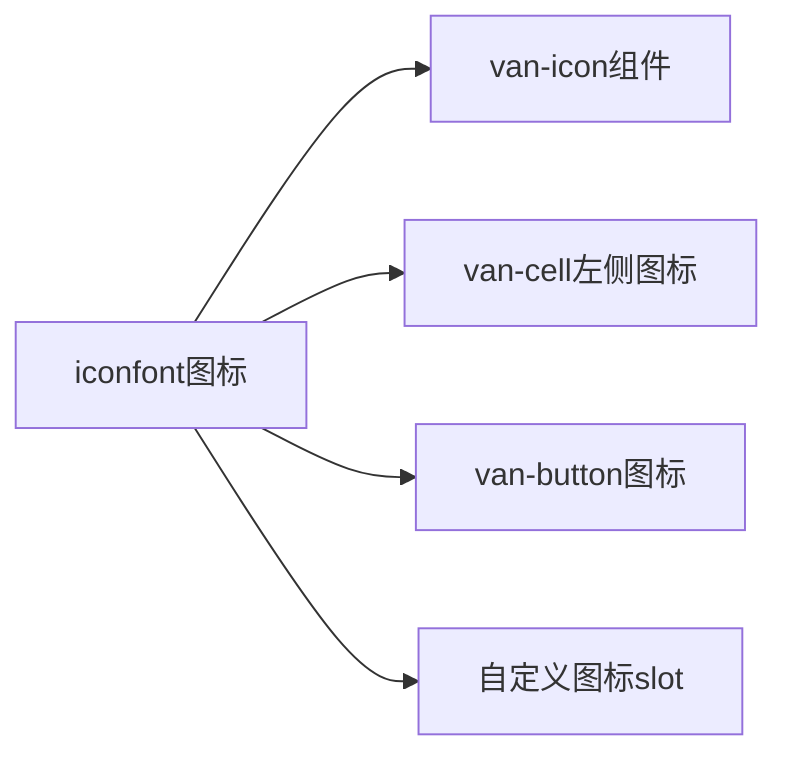
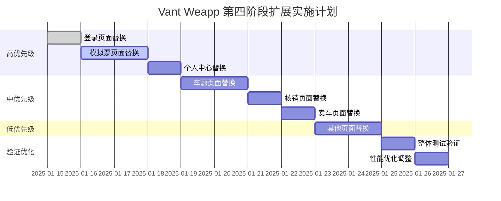

# Vant Weapp 第四阶段扩展实施设计

## 概述

本设计文档基于车小禾微信小程序 Vant Weapp 组件库接入的第四阶段扩展实施，在首页UI组件替换成功的基础上，继续推进其他关键页面的组件替换工作。

### 项目背景

车小禾微信小程序是一个车源信息和模拟票管理平台，目前已完成 Vant Weapp 组件库的前三个阶段：

1. **第一阶段**：环境准备（npm环境、依赖安装、项目配置）
2. **第二阶段**：组件引入配置（全局组件配置、页面级组件配置）
3. **第三阶段**：样式适配（主题统一、图标集成、样式微调）
4. **第四阶段**：组件替换（首页UI组件替换已完成）

### 当前状态

第四阶段首页替换已成功完成，包含：

- 联系信息区域使用 `van-cell-group` + `van-cell`
- 加载状态使用 `van-loading`
- 错误提示使用 `van-empty` + `van-button`
- 操作反馈使用 `van-dialog` + `van-toast`

## 架构分析

### 技术栈概览

| 技术组件 | 版本/说明 |
|---------|----------|
| 微信小程序框架 | 原生框架，包含.js、.wxml、.wxss文件结构 |
| UI组件库 | Vant Weapp @vant/weapp ^1.11.6 |
| 主题系统 | 金黄色主题 (#daa520) |
| 图标系统 | 阿里巴巴矢量图标库（iconfont） |
| 架构模式 | MVC架构，组件化设计 |

### 页面分类与优先级



## 组件替换策略

### 替换原则

1. **渐进式替换**：优先替换用户交互频繁的核心功能页面
2. **一致性保持**：确保替换后的UI风格与现有主题系统保持一致
3. **功能完整性**：替换过程中不破坏原有业务逻辑
4. **性能优化**：利用Vant组件的性能优势提升用户体验

### 组件映射策略

| 原生实现 | Vant组件 | 应用场景 |
|---------|----------|----------|
| 自定义卡片 | `van-card` | 车辆信息、模拟票信息展示 |
| 原生button | `van-button` | 操作按钮、提交按钮 |
| 自定义列表项 | `van-cell` + `van-cell-group` | 功能列表、信息列表 |
| 自定义加载 | `van-loading` | 数据加载状态 |
| 自定义空状态 | `van-empty` | 无数据状态 |
| wx.showModal | `van-dialog` | 确认对话框 |
| wx.showToast | `van-toast` | 消息提示 |
| 自定义搜索 | `van-search` | 搜索功能 |
| 自定义标签 | `van-tag` | 状态标签 |
| 自定义弹窗 | `van-popup` | 二维码弹窗、操作面板 |

## 第四阶段扩展实施方案

### 高优先级页面替换方案

#### 登录页面 (pages/login)

**替换目标**：提升登录体验，优化交互流程

**组件替换计划**：

| 功能模块 | 原实现 | 目标组件 | 预期效果 |
|---------|--------|----------|----------|
| 登录按钮 | 原生button | `van-button` | 统一按钮样式，支持加载状态 |
| 协议勾选 | 原生checkbox | `van-checkbox` | 标准化选择器样式 |
| 协议弹窗 | wx.showModal | `van-dialog` | 更好的弹窗体验 |
| 提示信息 | wx.showToast | `van-toast` | 统一消息提示样式 |

**实施步骤**：

1. 在 `login.json` 中引入所需Vant组件
2. 重构 `login.wxml` 模板结构
3. 更新 `login.js` 交互逻辑
4. 调整 `login.wxss` 样式适配

#### 模拟票页面 (pages/mock-tickets)

**替换目标**：统一卡片样式，优化票据展示

**组件替换计划**：

| 功能模块 | 原实现 | 目标组件 | 预期效果 |
|---------|--------|----------|----------|
| 票据卡片 | 自定义卡片 | `van-card` | 标准化卡片样式 |
| 状态标签 | 自定义标签 | `van-tag` | 统一标签样式 |
| 操作按钮 | 原生button | `van-button` | 按钮状态管理 |
| 二维码弹窗 | 自定义弹窗 | `van-popup` | 标准化弹窗体验 |

#### 个人中心页面 (pages/profile)

**替换目标**：优化功能列表，提升用户体验

**组件替换计划**：

| 功能模块 | 原实现 | 目标组件 | 预期效果 |
|---------|--------|----------|----------|
| 功能列表 | 自定义列表 | `van-cell-group` + `van-cell` | 标准化列表样式 |
| 头像显示 | 原生image | `van-image` | 支持懒加载、错误处理 |
| 操作面板 | wx.showActionSheet | `van-action-sheet` | 更好的操作体验 |

### 中优先级页面替换方案

#### 车源页面 (pages/vehicles)

**替换目标**：优化车辆信息展示，提升搜索体验

**组件替换计划**：

| 功能模块 | 原实现 | 目标组件 | 预期效果 |
|---------|--------|----------|----------|
| 车辆卡片 | 自定义车辆卡片组件 | `van-card` | 统一卡片样式 |
| 搜索功能 | 自定义搜索 | `van-search` | 标准化搜索体验 |
| 状态标签 | 自定义标签 | `van-tag` | 统一标签样式 |
| 空状态 | 自定义空状态 | `van-empty` | 标准化空状态 |

#### 核销页面 (pages/ticket-verification)

**替换目标**：优化核销流程，提升操作体验

**组件替换计划**：

| 功能模块 | 原实现 | 目标组件 | 预期效果 |
|---------|--------|----------|----------|
| 票据卡片 | 自定义卡片 | `van-card` | 统一卡片样式 |
| 扫码按钮 | 原生button | `van-button` | 标准化按钮 |
| 确认弹窗 | wx.showModal | `van-dialog` | 更好的确认体验 |

### 组件配置规范

#### 页面级组件配置标准

每个页面的 `.json` 配置文件应遵循以下规范：

```json
{
    "usingComponents": {
        "van-button": "/@vant/weapp/button/index",
        "van-card": "/@vant/weapp/card/index",
        "van-cell": "/@vant/weapp/cell/index",
        "van-cell-group": "/@vant/weapp/cell-group/index",
        "van-dialog": "/@vant/weapp/dialog/index",
        "van-empty": "/@vant/weapp/empty/index",
        "van-loading": "/@vant/weapp/loading/index",
        "van-popup": "/@vant/weapp/popup/index",
        "van-search": "/@vant/weapp/search/index",
        "van-tag": "/@vant/weapp/tag/index",
        "van-toast": "/@vant/weapp/toast/index"
    },
    "navigationBarTitleText": "页面标题"
}
```

## 样式系统集成

### 主题变量适配

基于现有主题系统 (`assets/styles/theme.wxss`)，确保Vant组件与项目主题保持一致：

| 主题变量 | 值 | 应用范围 |
|---------|---|----------|
| 主色调 | #daa520 | 按钮、标签、强调色 |
| 文字颜色 | 根据现有主题 | 所有文本内容 |
| 背景色 | 根据现有主题 | 卡片、容器背景 |
| 边框颜色 | 根据现有主题 | 分割线、边框 |

### 图标系统集成

继续使用阿里巴巴矢量图标库（iconfont），在Vant组件中通过以下方式集成：



## 实施计划

### 阶段划分



### 每日实施目标

| 日期 | 目标页面 | 主要任务 | 验收标准 |
|------|----------|----------|----------|
| Day 1 | 登录页面 | 组件配置、模板重构、逻辑更新 | 登录流程正常，UI符合设计 |
| Day 2-3 | 模拟票页面 | 卡片替换、弹窗替换、状态管理 | 票据展示正常，二维码功能正常 |
| Day 4 | 个人中心 | 列表替换、头像优化、操作面板 | 功能列表正常，用户信息展示正常 |
| Day 5-6 | 车源页面 | 搜索替换、卡片统一、空状态 | 搜索功能正常，车辆展示正常 |
| Day 7 | 核销页面 | 票据卡片、操作按钮、确认流程 | 核销流程正常，UI交互流畅 |
| Day 8 | 卖车页面 | 车辆卡片、操作按钮、删除模式 | 车辆管理功能正常 |

## 质量保证

### 测试策略

#### 功能测试

1. **UI一致性测试**：确保替换后的组件风格与整体设计保持一致
2. **交互测试**：验证所有用户交互功能正常工作
3. **业务逻辑测试**：确保替换过程中业务逻辑未受影响
4. **兼容性测试**：测试在不同微信版本和设备上的兼容性

#### 性能测试

1. **加载性能**：对比替换前后的页面加载时间
2. **内存占用**：监控组件替换对内存使用的影响
3. **操作响应**：测试用户操作的响应速度

### 验收标准

#### 技术验收

| 验收项 | 标准 | 检查方法 |
|--------|------|----------|
| 组件引入 | 所有页面正确引入所需Vant组件 | 检查.json配置文件 |
| 样式一致性 | 替换后UI与项目主题保持一致 | 视觉对比检查 |
| 功能完整性 | 所有原有功能正常工作 | 功能测试 |
| 性能表现 | 页面加载和操作响应满足要求 | 性能监控 |

#### 用户体验验收

| 验收项 | 标准 | 检查方法 |
|--------|------|----------|
| 交互流畅性 | 所有交互操作流畅无卡顿 | 实际操作测试 |
| 视觉一致性 | 整体视觉风格统一协调 | 设计评审 |
| 错误处理 | 异常情况下有合适的用户提示 | 异常场景测试 |

## 风险评估与应对

### 潜在风险

| 风险类型 | 风险描述 | 影响程度 | 应对策略 |
|---------|----------|----------|----------|
| 兼容性风险 | Vant组件在某些设备上表现异常 | 中等 | 充分测试，保留原生实现作为备用 |
| 性能风险 | 组件库引入导致性能下降 | 低 | 性能监控，按需加载 |
| 样式风险 | 组件样式与现有主题冲突 | 中等 | 样式覆盖，主题定制 |
| 功能风险 | 替换过程中功能缺失或异常 | 高 | 充分测试，分步替换 |

### 回滚策略

如果在替换过程中遇到不可解决的问题，可以按照以下策略进行回滚：

1. **页面级回滚**：恢复单个页面的原生实现
2. **组件级回滚**：针对特定组件回滚到原生实现
3. **完整回滚**：回滚到替换前的完整状态

## 后续优化方向

### 组件扩展

基于Vant组件的使用经验，考虑以下扩展方向：

1. **自定义组件封装**：基于Vant组件封装项目特定的业务组件
2. **主题深度定制**：进一步定制Vant组件主题以完全匹配项目设计
3. **性能优化**：基于实际使用情况进行针对性的性能优化

### 开发效率提升

1. **组件使用规范**：建立团队共识的组件使用规范
2. **最佳实践总结**：总结替换过程中的最佳实践经验
3. **工具链优化**：优化开发工具链以支持更高效的组件开发

## 测试验证

### 关键测试场景

1. **登录流程测试**：验证整个登录流程的完整性和用户体验
2. **票据管理测试**：测试模拟票的创建、展示、核销等完整流程
3. **车辆信息测试**：验证车辆信息的展示、搜索、操作等功能
4. **用户中心测试**：测试个人中心的各项功能和信息展示

### 性能基准

建立以下性能基准用于替换前后的对比：

| 性能指标 | 基准值 | 目标值 |
|---------|--------|--------|
| 首页加载时间 | 当前值 | 不超过当前值的110% |
| 列表滚动帧率 | 当前值 | 不低于当前值 |
| 内存使用峰值 | 当前值 | 不超过当前值的120% |
| 交互响应时间 | 当前值 | 不超过当前值 |
